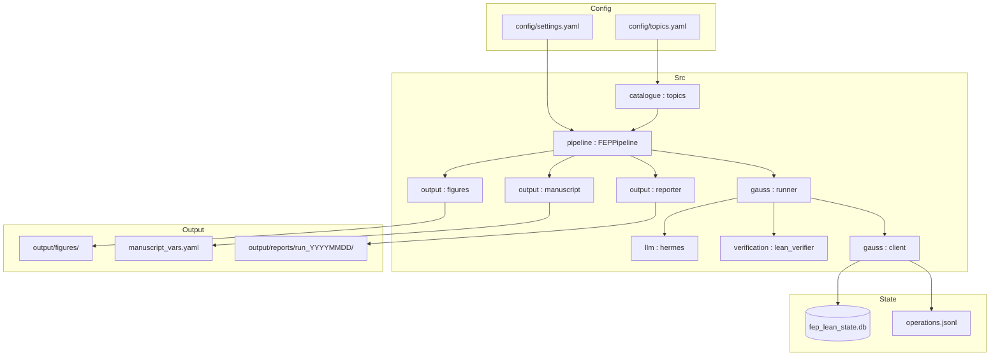

# fep_lean — Functional Specification

**Version**: v0.7.1 | **Status**: Active | **Last Updated**: April 2026

## Scope

`fep_lean` is an **agentic formalization project** integrated into the research template architecture. It orchestrates a 4-stage DAG (Load Catalogue → Environment Validation → Gauss Sessions → Manuscript Artifacts; run reporting runs in the enclosing `orchestrator.run_pipeline`) to convert natural language Free Energy Principle (FEP) theorems into Lean 4 sketches, validates them via LLM (Hermes) and native compilers (`lake env lean`), and persists the results to SQLite.

Business logic lives exclusively in `src/`. `scripts/01_fep_catalogue_and_figures.py` is a thin orchestrator invoked by `scripts/02_run_analysis.py` with `PROJECT_DIR` set.

## Data

- **Catalogue**: `config/topics.yaml` — 50 `TopicEntry` records (`fep-001`…`fep-050`), each with `id`, `title`, `area`, `mathlib`, `mathlib_status`, `nl`, `lean_sketch`. Lean bodies are authored in `scripts/catalogue_sketches.py` (`SKETCHES`); `scripts/_maint_build_topics_catalogue.py` regenerates the YAML. `tests/test_catalogue_sketches_ssot.py` asserts YAML `lean_sketch` matches `SKETCHES` for every id.
- **Inputs**: `OPENROUTER_API_KEY`, `GAUSS_HOME` environment variables.
- **Outputs**:
  - `fep_lean_state.db` — SQLite persistence of all formalization sessions
  - `manuscript/manuscript_vars.yaml` — dynamically injected variables
  - `manuscript/09z_unified_formalism_catalogue.md` — gitignored; all 50 topics with Lean + typeset LaTeX juxtaposed (from `write_unified_formalism_appendix_markdown`; `{#sec:…}` anchors, `equation` + `\label{eq:…}`; B/C PDF labels preserved; see `docs/xref_audit.py`)
  - `output/figures/*.png` — SVG/PNG Mathlib coverage charts
  - `output/reports/run_<UTC>/` — final modular Markdown + JSON report

## Open Gauss (math-inc) and SQLite

The term "Open Gauss" has two meanings in this project:

1. **`gauss` CLI**: The [math-inc/OpenGauss](https://github.com/math-inc/OpenGauss) binary. If present on PATH, `gauss.cli.check_gauss_cli` runs `gauss doctor` during validation. Success/failure is recorded.
2. **`OpenGaussClient`**: Our native Python persistence layer (`src/gauss/client.py`). It creates a SQLite database at `{GAUSS_HOME}/fep_lean_state.db` to permanently store formalization sessions (with per-topic turns), extracted artifacts, and JSONL event logs.

## Pipeline (DAG)

When `FEP_LEAN_GAUSS_WORKFLOWS=1`, `orchestrator.run_pipeline` delegates to `FEPPipeline`:

1. **Load Catalogue**: Parse topics from `config/topics.yaml` (optional filters).
2. **Validate Environment**: Run 13 system checks (`verification.environment.run_validation_checks`).
3. **Gauss Sessions** (when `FEP_LEAN_GAUSS_WORKFLOWS=1`): `GaussRunner` per topic — SQLite session, Hermes (`llm.hermes`), `LeanVerifier.verify_sketch` (`lake env lean`), artifacts.
4. **Manuscript Artifacts**: `write_manuscript_vars` and `write_unified_formalism_appendix_markdown` run on one thread concurrently with `write_all_catalogue_figures` on another (`ThreadPoolExecutor` in `pipeline/core.py`). Charts use `ProcessPoolExecutor` (spawn) in `output/figures.py` unless `FEP_LEAN_FIGURES_MP=0`. Optional **`FEP_LEAN_PREFETCH=1`** overlaps Hermes for topic *N+1* with Lean verify on topic *N* in `GaussRunner` (`verify` workflow, ≥2 topics).
5. **Reporting**: `Reporter.generate` from `pipeline.orchestrator.run_pipeline` (full run) or skipped for `run_single_topic`.

## Testing Policy

- **Zero Mocks**: Real `tmp_path` SQLite databases, real `urllib.request` HTTP calls (skipped without API key), real `lake env lean` (skipped if absent). No `unittest.mock`.
- **Coverage**: `src/` under pytest-cov ≥89% combined line+branch (see `pyproject.toml`); CI mirrors this threshold.

## Catalogue maturity (`mathlib_status`)

- **All 50 rows** use **`mathlib_status: real`**. Canonical Lean bodies live in **`scripts/catalogue_sketches.py`**; **`scripts/_maint_build_topics_catalogue.py`** writes `config/topics.yaml`. Sketches are **`sorry`-free** topic anchors (definitions and short lemmas), not full formalizations of every catalogue title.
- Tests in **`tests/test_fep_topics.py`** assert 50 topics, all `real`, and area/maturity rollups. **`tests/test_catalogue_sketches_ssot.py`** asserts `topics.yaml` ↔ `SKETCHES` agreement. Optional **`tests/test_catalogue_sketches_compile.py`** runs all 50 native checks when **`FEP_LEAN_CATALOGUE_COMPILE_TEST=1`** (skipped by default). Per-row `lake env lean` compilation is exercised by **`scripts/03_lean_verify_only.py`** (stdout logging only; no manifest file) and, when **`FEP_LEAN_GAUSS_WORKFLOWS=1`**, the **Gauss Sessions** stage (**`GaussRunner`** + **`LeanVerifier`**). Full pipeline runs emit **`output/reports/run_*/verification_manifest.json`**, **`summary.json`**, and per-topic **`topics/*.md`** (see `output.reporter.Reporter`); the headline rate (**`{{compile_rate_total}}`** in `manuscript_vars.yaml`, or **50/50** after a green verifier sweep) is reported in §`04e`.

- First-time Mathlib setup: **`scripts/_maint_bootstrap_lean_toolchain.sh`** (also triggered from repo **`scripts/00_setup_environment.py --project fep_lean`** when the cache is incomplete). Pin: **`leanprover/lean4:v4.29.0`**, Mathlib **`v4.29.0`** (`lean/lakefile.lean`).

## Toolchain preflight (`uv run fep-lean-preflight`)

- Console script from **`pyproject.toml`**: runs optional **`gauss doctor`** (fails only with `--require-gauss` or `FEP_LEAN_REQUIRE_GAUSS=1`), then **`lean`/`lake` `--version`**, then **`LeanVerifier.check_mathlib_built()`**.
- Implementation: **`src/verification/preflight.py`**.

## Lean verification (`scripts/03_lean_verify_only.py`)

- Requires **`lake`** on `PATH` and a **built Mathlib** workspace: `Mathlib.olean` must exist under `lean/.lake/packages/mathlib/.lake/build/lib/` (after `cd lean && lake exe cache get && lake build`).
- Uses **stdlib `logging`** only (no repo-root `infrastructure` import). Run from the project root: `uv run python scripts/03_lean_verify_only.py`. Writes **log output only**; JSON compile aggregates for manuscripts come from **`Reporter`** (`verification_manifest.json` under `output/reports/run_*/`) after a full pipeline run with workflows enabled.
- **Preflight**: `LeanVerifier.check_mathlib_built()` runs before batch verification; exits **1** with an actionable message if Mathlib is not built.
- **Exit code**: **0** only if every requested topic compiles; otherwise **1** (so CI and scripts can rely on status).

## CI catalogue compile gate

- In **GitHub Actions** (`.github/workflows/ci.yml`, job `fep-lean`), after **`lake build`**, **`uv run pytest tests/`** runs the full suite (including **`test_catalogue_sketches_ssot`** and **`test_lean_verifier`** / **`test_lean_verifier_sad_paths`**, which exercise the verifier itself against real `lake env lean` invocations on representative sketches). The full per-row 50-topic sweep is then driven by **`uv run python scripts/03_lean_verify_only.py`**, which exits non-zero if any requested topic fails to compile. Failures in either step block the job.
- The CI job runs **`uv sync --extra dev`** (from the project directory) before tests so the **`fep_lean`** venv is explicit.

## Catalogue maintenance

After editing **`scripts/catalogue_sketches.py`**, run **`uv run python scripts/_maint_build_topics_catalogue.py`** so `config/topics.yaml` stays in sync. Use **`assert_complete()`** in that module to keep keys exactly `fep-001`…`fep-050`. Deeper formalizations (stronger statements, new imports) are ordinary Mathlib work; keep verifier batch checks green.

## Monorepo Stage 02 (template)

Template **`scripts/02_run_analysis.py`** (repo root) invokes this project’s `scripts/*.py` with per-script subprocess timeouts. Default **`ANALYSIS_SCRIPT_TIMEOUT_SEC`** is **7200** seconds unless overridden; see **`infrastructure/core/analysis_timeout.py`** at the repository root.

## Architecture

