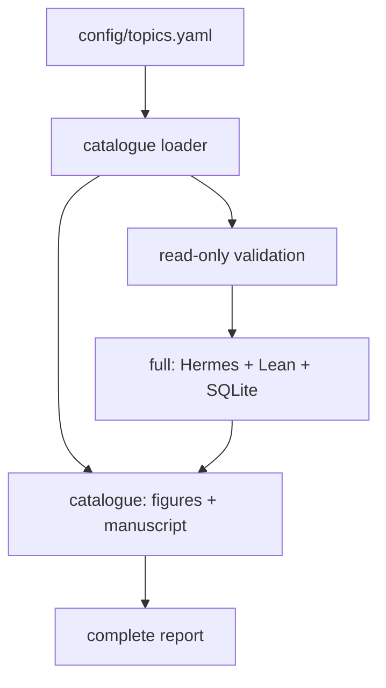

# Architecture

The source is split into six packages:

- `catalogue` validates YAML and source parity;
- `verification` probes the pinned Lean workspace without building it;
- `llm` performs configured Hermes HTTP calls;
- `gauss` persists sessions and runs per-topic verification;
- `output` writes deterministic artifacts and manifests;
- `pipeline` enforces the `full`/`catalogue` execution contract.

`src/cli.py` is the only public command surface. The generated Lean aggregate
is tracked and regenerated from `scripts/catalogue_sketches.py`.
