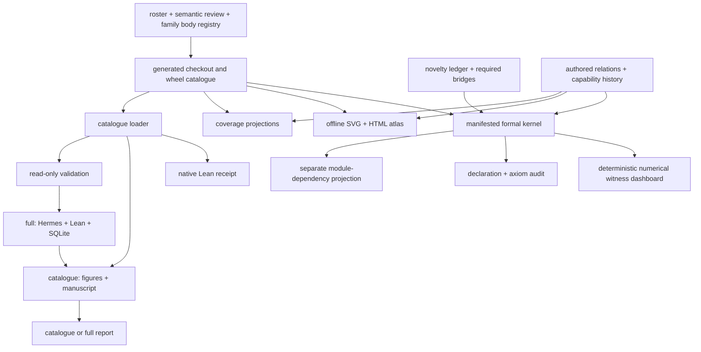

# Architecture

The installable `fep_lean` namespace is split into seven principal packages:

- `catalogue` validates YAML and source parity;
- `formal` packages the manifested foundations and leaf cross-topic
  compositions, plus an import-only aggregate, and projects them into Lake;
- `verification` probes the pinned Lean workspace without building it;
- `llm` performs configured Hermes HTTP calls;
- `gauss` persists sessions and runs per-topic verification;
- `output` writes typed native evidence, source-preserving manuscript renders,
  deterministic artifacts, and full-run manifests;
- `pipeline` enforces the `full`/`catalogue` execution contract.

`src/fep_lean/cli.py` is the only public command surface. Canonical Lean bodies
live in family modules under `src/fep_lean/catalogue/bodies/`; the validated
registry merges them and `latex.py` projects theorem signatures.
The checkout/package YAML pair, aggregate Lean file, formal-module workspace
copies, semantic audit, coverage map, formalism atlas, and formal-kernel
dashboard are generated projections with non-mutating freshness checks.
`config/formalism_relations.yaml` is maintained review data: it distinguishes
declaration-witnessed formal composition, conceptual adjacency, and missing
capabilities from mechanically derived import incidence. Capability nodes are
retained when satisfied so resolution evidence is not erased.
The atlas gives formal modules their own cards and renders internal import
dependencies in purple, outside the authored scientific-edge collection. The
dashboard renders deterministic finite witnesses for selected laws; it is an
explanatory projection, not proof evidence.

Catalogue generation, native Lean verification, and credentialed full
Hermes/OpenGauss execution are separate evidence planes. No completion flag is
reused across those boundaries without independent receipt validation.

The shared mathematical contracts and the distinction between structural,
numerical, deductive, and execution evidence are documented in
[Formal-kernel methods](formal-kernel-methods.md).
