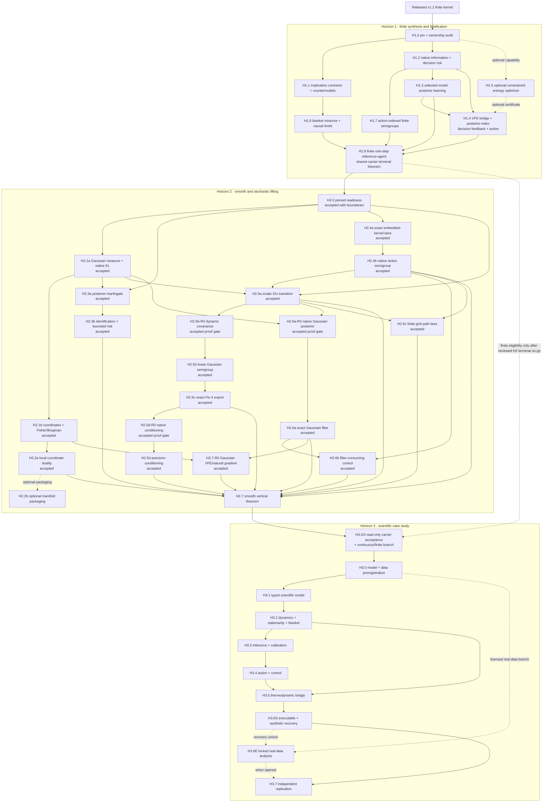

# Dependency map and merge barriers

This map is the scheduling authority for the program. A solid edge means the
source package must pass before the target starts. A dashed edge is a named
optional or conditional branch and must be either passed or explicitly removed
by its recorded no-go action. An edge does not mean that the associated
scientific proposition has been proved.



## Merge barriers and vertical spine

There is no valid single-file "minimum path." Parallel lanes may execute at the
same time, but every solid incoming edge is a merge prerequisite. The program's
vertical spine is therefore a sequence of barriers:

```text
released kernel
  -> H1.0 ownership and pin barrier
  -> {H1.1, H1.2, H1.3, H1.4, H1.6, H1.7}
  -> H1.8 finite terminal merge
  -> H2.0 readiness barrier with explicit row-level no-go decisions
  -> {H2.1a/b, H2.2a, H2.3a/b, H2.4a/b,
      H2.5a, H2.5b-R0, H2.5b/c/d, H2.6a-R0, H2.6a/b/c}
  -> H2.7 smooth terminal merge
  -> H3.G0 read-only carrier acceptance + exactly-one branch
  -> H3.0 frozen protocol
  -> {H3.1, H3.2, H3.3, H3.4, H3.5, H3.6S}
  -> optional H3.6E locked real-data branch
  -> H3.7 independent replication
```

H1.5 is the only dashed optional capability lane. It may strengthen H1.4 with a
general constrained-entropy certificate, but H1.4 must normalize its selected
finite policy law without depending on that generalization. The finite-vector
exponential-family and general calibration programs are likewise optional
extensions inside H2.1 and H1.3, not hidden blockers on the vertical spine.

Horizon 1 has exited. Its maintained blocked-merge theorem still proves that
the old point-mass Boolean policy belief and two-state transition cannot be
identified with the learned posterior and sixteen-state blanket carrier. The
accepted repair changes those intermediate carriers and proves their marginal,
posterior, action, transition, stationary-blanket, and KL bridges explicitly;
it does not weaken the old no-go. H2.0 has now exited with 25 `go`, 13
`optional_no_go`, three `blocking_no_go`, and one `upstream_required` decision.
Only slices whose exact incoming rows are green may open. H2.1, H2.2a,
H2.3a/b, H2.4a/b, H2.5a/b/c/d, H2.5b-R0, H2.5d-R0, H2.6a/b/c, and H2.6a-R0
and H2.7-R0 have exited. H2.7 is the only legal implementation slice now
open; H3 remains closed at its named seam.

A no-go decision must update both the affected terminal clause and every
outgoing edge before dependent work continues. A stopped solid lane either
blocks its merge or triggers an explicitly reviewed weaker terminal theorem;
it is never silently omitted.

## Cross-horizon stop/go summary

The horizon implementation matrices instantiate every package contract. This
table highlights only the gates most likely to change the cross-horizon DAG.

| Gate | Go | No-go action |
| --- | --- | --- |
| H1.0 pin surface | Every cited native API compiles at the exact pin and current absence claims are source-grounded | Correct documentation, narrow the target, or open an upstream prerequisite before mathematical implementation |
| H1.0 composition ownership | A new terminal leaf has a unique owner and its endpoint dependencies are inspectable | Open an architecture slice before adding cross-domain theorems; do not append to an ambiguous flat owner |
| H1.1 countermodel translation | Domain reviewers agree on exact premises and conclusion from the primary source | Retain the question as prose; do not formalize a caricature |
| H1.7 action-indexed finite semigroup | Row sums, nonnegativity, semigroup, master equation, selected-action sampling, and strict product-carrier refresh witness derive; the separate three-state model retains nonzero current | Keep a certified semigroup interface and exact witnesses; remove generic construction or strictness from H1.8 and upstream reusable positivity |
| H1.8 finite merge | Repeated-sample posterior, one-step posterior decision, emitted action, sampled semigroup, genuine sensory--active blanket factorization, invariant stationary law, and finite/native KL clauses share exact values and types | Retain the first blocked-merge theorem and repair carriers upstream; never treat predecessor conjunctions, a singleton conditioner, or an action-label coincidence as a terminal theorem |
| H2.0 pinned readiness | Every row is source-bound to the exact pin, warning-free positive probes, or a bounded negative search; partial constructions are labeled `upstream_required` or `blocking_no_go` | Preserve the frozen H2.0 decisions as historical evidence. H2.5b-R0/H2.5b repair transition covariance, H2.6a-R0/H2.6a repair the native filter, H2.5c repairs exact scalar-to-Fin4 specialization, and H2.5d-R0 plus maintained H2.5d repair the centered and arbitrary-center native conditioning seams on their selected carriers |
| H2.2 local dual geometry | Local coordinate duality compiles without inventing a second manifold library; global claims pass their own Legendre gate | Keep only local coordinate results; any VFE/natural-gradient claim must pass H2.7-R0 rather than being inferred from coordinate duality |
| H2.4 native action-indexed seam | Native `MarkovSemigroup` and `ActionIndexedMarkovSemigroup` compile, and the H1 lift's sampled kernel is exactly `FEP.NativeBlanket.embeddedKernel` of the H1 sampled kernel | Retain H1's finite interface and block H2.5--H2.7; never add a second action carrier or an assumed embedding field |
| H2.5 scalar + `Fin 4` OU | The scalar transition proves normalization, semigroup, invariant law, moments, and weak convergence; before H2.7, the exact symmetric-positive `K`, derived `Sigma = K⁻¹`, dynamic transition covariance, four-coordinate semigroup, exact scalar specialization, and conditioning/precision seam also pass | Stop before SDE language. Retain the accepted scalar and finite-axis algebra while keeping H2.7 and continuous H3 eligibility closed if the terminal merge fails |
| H2.7-R0 Gaussian VFE/natural gradient | Actual H2.6a evidence density and posterior law support a recognition-to-posterior KL VFE gap, Fisher-metric-dual tangent, and strict local negative-flow derivative | Do not substitute H1 finite VFE or H2.2 coordinate duality; keep H2.7 and continuous H3 closed |
| H2.7 smooth merge | One scalar Gaussian carrier is used by geometry, posterior, OU, filtering, control, and dissipation, and the separate required H2.5 `Fin 4` export is accepted in the same barrier | Do not ship a terminal theorem; retain predecessor evidence and a blocked-merge record |
| H3.G0 carrier/branch acceptance | A read-only, source-bound record accepts H2.5/H2.7 for continuous eligibility, accepts repaired H1.8 for finite eligibility, and selects exactly one branch before H3.0 | Keep H3.0--H3.7 closed or select the other already-green carrier; do not prove, patch, or hybridize carriers in H3.G0 |
| H3.0 data feasibility | Data license, variables, sampling frequency, interventions, and identifiability meet the frozen protocol | Publish a synthetic case study and a documented empirical no-go; do not substitute convenient data |
| H3.6S model recovery | Synthetic model and parameter recovery meet preregistered thresholds | Remove the dashed H3.6S--H3.6E unlock; do not fit real data, repair thresholds post hoc, or hide rejection |
| H3.6E held-out comparison | The locked analysis completes against capacity-matched baselines | Retain null/negative result and forbid post-hoc supportive relabeling; H3.7 publishes an empirical-unavailable/null row |
| H3.7 clean-room replication | Independent rebuild reproduces symbolic and synthetic fixtures, hashes, and claim classifications | Block publication/promotion and route each mismatch to its owning H3 row |

## Parallel work limits

- Literature translation and Lean API spikes may run in parallel, but theorem
  statements wait for both.
- A foundation and its behavior tests may be developed together; a composition
  leaf waits for stable endpoint declarations.
- Numerical witnesses wait for theorem signatures and never define them.
- H3 data-governance and unit-schema reconnaissance may start during late H2,
  but H3.G0 is read-only and post-H2, H3.0 remains a hard dependency of H3.1,
  and data inspection that could affect hypotheses waits for the
  preregistration freeze.
- Toolchain migration is serialized with all Lean work and invalidates native,
  formal, and publication evidence.
