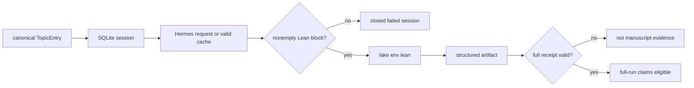

## The Hermes AI Agent and LLM-Assisted Formalization {#sec:the_hermes_ai_agent_and_llm_assisted_formalization}

### Architecture Overview {#sec:architecture_overview}

`fep_lean.llm.hermes.HermesExplainer` reviews a curated `TopicEntry`. It does not own the catalogue, overwrite a canonical topic body, or establish a theorem merely by returning text. Family modules under `src/fep_lean/catalogue/bodies/` own those bodies and `registry.py` validates their ordered union; `config/topics.yaml` is the generated projection. A live model response becomes relevant only after its extracted Lean block is compiled and its complete run bundle passes independent receipt validation.

The client uses standard-library HTTP against an OpenAI-compatible endpoint. Configuration is resolved from explicit environment values, project settings, and built-in defaults. The exact configured model and fallback roster are operational facts in `config/settings.yaml` and the validated run manifest; copying them into the paper would create a second, rapidly stale owner.

### Gauss Session Protocol {#sec:gauss_session_protocol}

For each selected topic, `GaussRunner` performs the following state transition:

1. create an SQLite session containing the topic id, area, workflow, and canonical body;
2. retrieve an unexpired, toolchain-salted Hermes cache entry or make a live request;
3. persist the system, user, assistant, and optional reasoning turns;
4. reject an unsuccessful response or one without an extracted Lean block;
5. compile the refined block with `LeanVerifier`;
6. persist a structured artifact containing Hermes and compiler fields; and
7. close the session with an explicit success or failure status.

An exception cannot silently leave a successful session: the runner closes an active session with the exception information. Cache writes require both model success and a nonempty extracted sketch, preventing a truncated response from poisoning later runs. Cache keys include the topic body, workflow stage, model, exact rendered-message digest, and Lean/Mathlib salt, so a prompt change cannot inherit an older response accidentally. Persisted request/response turns use contiguous indices and retain the exact prompt that generated the cached or live result.

### FEP-Domain System Prompt {#sec:fep_domain_system_prompt}

The system prompt asks for a short mathematical explanation and one refined Lean block. Its load-bearing constraints are concrete: copy the original imports, preserve the `FEPNNN` namespace, retain explicit tactic hint lists, and never introduce `sorry` into a source that was already `sorry`-free. Workflow preambles may request draft, prove, review, or verify behavior, but they do not weaken the compiler or receipt gates.

Prompt constraints reduce predictable damage; they do not certify semantic fidelity. A model may preserve a compiling theorem while changing its meaning, or provide persuasive commentary for a weak proxy. In the two-pass `review` workflow, the initial candidate must compile cleanly with no warnings or `sorry` before the prose-only review is requested; a review that returns a replacement Lean block is rejected rather than silently changing the compiled candidate. The canonical theorem remains researcher-maintained, and the semantic audit remains independent of both model confidence and compiler success.

### Hermes vs Native Lean: Compilation Diagnostics {#sec:hermes_vs_native_lean_diagnostics}

Hermes success and Lean success are orthogonal. A well-formed explanation can accompany a non-compiling block; a compiling block can express a weak or irrelevant theorem. Accordingly, the report schema records the model response, direct refined-sketch outcome, final compiler fields, and semantic disposition separately. No aggregate rate is inferred from a catalogue-only run.

### Compiler Output and the `VerifyResult` Dataclass {#sec:compiler_driven_error_loop}

`LeanVerifier.verify_sketch` returns a structured `VerifyResult`: `compiles`, `has_sorry`, warnings, errors, stdout/stderr, duration, Lean version, skip reason, and an advisory failure class. Its status projection distinguishes `compiles_clean`, `compiles_with_sorry`, `compile_error`, and `skipped (...)`. The failure classifier helps triage missing imports, renamed identifiers, tactic failures, arity/type mismatches, and timeouts, but it is not proof evidence itself.

The full workflow does not treat the canonical body as a hidden success fallback after Hermes failure. If Hermes is disabled, lacks credentials, returns no usable candidate, or exhausts its model attempts, the topic fails full mode. Native verification of the canonical catalogue is available as a separate `fep-lean verify` contract.

### Token Usage and Cost Profile {#sec:token_usage_and_cost_profile}

Token, model, cache, retry, and latency fields are populated only from an independently validated full report. At render time the current full-claim predicate is `{{full.claim_ready}}`. If it is false, model totals and timings are unavailable rather than borrowed from an old or catalogue-only directory. This policy is important because provider latency, context accounting, and model availability are mutable external conditions.

For a claim-ready run, `summary.json` remains the primary quantitative record: it contains per-topic model identity, token count, duration, cache status, same-model retries, and chain-advance reason. The manuscript may summarize those values but never substitutes configuration defaults for observations.

### Model Fallback Chain and Degradation {#sec:model_fallback_chain_and_degradation}

`HermesExplainer` builds an ordered chain from the configured primary and deduplicated configured/built-in fallbacks. A configurable cap can bound attempted models. A successful response records the model actually used; failure records the last error rather than inventing content.

The client validates obvious key/endpoint mismatches and uses a bounded preflight probe. A fatal authentication/client error may disable Hermes for the remainder of a run. Transport failures and rate limits are bounded rather than retried indefinitely. These are availability mechanisms, not mechanisms for choosing the mathematically best answer.

### Three Classes of Fallback {#sec:three_classes_of_fallback}

The implementation distinguishes mechanisms that are often conflated in LLM reports:

| Mechanism | Trigger | What changes | Recorded field | Evidentiary interpretation |
|---|---|---|---|---|
| Same-model retry | HTTP `429` or a transient transport failure | network attempt only | `network_retries`, aggregated as `network_retry_count` | bounded availability recovery on the same model |
| Cross-model advance | empty content, wall-clock timeout, non-retriable HTTP failure, transport failure, or parse failure | provider model | `chain_advance_reason`, `model_used`, aggregated as `model_fallback_count` and `chain_advance_reasons` | the configured primary did not supply the accepted response |
| Hermes-refined Lean outcome | the returned refinement is compiled with `lake env lean` | no provider retry; this occurs after the LLM stage | `hermes_lean_compiles_count` | a failed refinement remains a topic failure; no baseline body is substituted |
| Native canonical verification | the curated catalogue is compiled independently of Hermes | execution mode | source-bound native receipt | separate non-LLM evidence contract |

`HermesResult` carries the per-call retry count and labeled chain-advance cause,
and `TopicRunResult.as_dict()` propagates them into `summary.json`. The
manuscript renderer aggregates only a claim-ready full report. Native
verification is deliberately not counted as Hermes success; keeping the two
planes separate prevents a curated canonical body from masking a failed live
model experiment.
